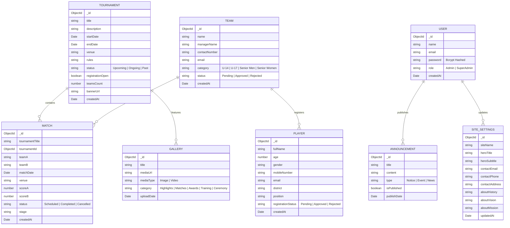

# Pune District Handball Association (PDHA) Web Platform
## Comprehensive Technical Overview & System Architecture Report

---

## 1. Executive Summary

The **PDHA Web Platform** is an enterprise-grade, high-performance web application engineered for the **Pune District Handball Association (PDHA)**. It serves as both a public portal for athletes, team managers, and sports fans in Pune, and a secure administrative management dashboard for association officials.

### Key Objectives
1. **Public Digitization**: Streamline player registrations, team entries, match schedules, live results, official notices, and photo/video archives.
2. **Administrative Governance**: Provide association officials with real-time controls to review and approve/reject registrations, schedule fixtures, log live scores, organize tournaments, and publish media announcements.
3. **Data Integrity & Speed**: Utilize Next.js Server Actions, MongoDB database transactions, and on-demand cache revalidation to guarantee sub-second updates across all public pages.

---

## 2. Technology Stack & Infrastructure

```
┌─────────────────────────────────────────────────────────────┐
│                      Frontend Layer                         │
│  Next.js 16 (App Router) • React 19 • Tailwind CSS v4       │
│  Base UI Primitive Components • Lucide Icons • Sonner Toast │
└──────────────────────────────┬──────────────────────────────┘
                               │ Server Actions / RPC
┌──────────────────────────────▼──────────────────────────────┐
│                    Application / Backend                    │
│  Next.js Server Actions • NextAuth.js (Auth v5) • Zod       │
│  Bcrypt.js Hashing • Next Cache (revalidatePath)            │
└──────────────────────────────┬──────────────────────────────┘
                               │ Mongoose ORM
┌──────────────────────────────▼──────────────────────────────┐
│                      Database Layer                         │
│  MongoDB Atlas / MongoDB Community Server                   │
└─────────────────────────────────────────────────────────────┘
```

| Technology | Version | Purpose |
| :--- | :--- | :--- |
| **Framework** | Next.js 16.2 (Turbopack) | Server-Side Rendering (SSR), Static Generation (SSG), Server Actions |
| **UI Library** | React 19 | Component hierarchy, optimistic state transitions (`useTransition`) |
| **Styling** | Tailwind CSS v4 | Responsive design, modern color tokens, micro-interactions |
| **Headless UI** | `@base-ui/react` | Accessible Dialog modals, Tabs, Selects, Dropdowns |
| **Validation** | Zod + React Hook Form | Strict client-side and server-side input validation |
| **Database** | MongoDB + Mongoose 9 | Document database with schema enforcement and index management |
| **Authentication** | NextAuth.js + Bcrypt.js | Protected JWT administrative session authentication |
| **Icons & Alerts** | Lucide React + Sonner | Clean vector iconography and rich toast notifications |

---

## 3. Database Architecture & Schema Reference

All data models reside in `src/models/` and are built using Mongoose with TypeScript interfaces.



---

## 4. Server Actions & Backend API Directory

The application relies on Next.js **Server Actions** (`"use server"`), eliminating unnecessary REST boilerplate while providing full type safety and automatic route cache invalidation.

```
src/lib/actions/
├── register.ts       # Player & Team registrations, admin status approvals, deletions, and stats
├── matches.ts        # Fixtures scheduling, live score updates, match deletions
├── tournaments.ts    # Tournament creation, updates, status toggles, deletions
├── gallery.ts        # Media photo/video upload, category tagging, deletions
├── announcements.ts  # Public notices, trials information, news updates
└── settings.ts       # Site branding, hero headlines, association contacts
```

### Action Implementation Highlights

#### 1. Registration Management (`src/lib/actions/register.ts`)
- `registerPlayer(formData)`: Validates age (5–60), mobile number, email, position, district; creates MongoDB record with `"Pending"` status.
- `registerTeam(formData)`: Validates team name, manager details, category; creates MongoDB record with `"Pending"` status.
- `getRegistrations()`: Fetches all registered players and teams sorted by newest first.
- `updatePlayerStatus(playerId, 'Approved' | 'Rejected')`: Approves/rejects player entry and calls `revalidatePath('/admin/dashboard/registrations')` and `revalidatePath('/admin/dashboard')`.
- `updateTeamStatus(teamId, 'Approved' | 'Rejected')`: Approves/rejects team entry.
- `deletePlayerRegistration(id)` & `deleteTeamRegistration(id)`: Permanently removes duplicate/spam records.
- `getRegistrationStats()`: Computes total, pending, approved, and rejected counters for the admin dashboard.

#### 2. Match Results & Fixtures (`src/lib/actions/matches.ts`)
- `createMatch(data)`: Schedules fixture with date/time, venue, tournament title, stage, and teams.
- `updateMatch(id, data)`: Records live or final scores (`scoreA`, `scoreB`) and updates status to `"Completed"` or `"Cancelled"`.
- `getMatches()`: Fetches fixtures sorted by date for the public fixtures schedule and live homepage ticker.
- `deleteMatch(id)`: Removes match fixture.

#### 3. Tournaments Management (`src/lib/actions/tournaments.ts`)
- `createTournament(data)`: Publishes tournament with start/end dates, venue, rules, teams capacity, and custom banner URLs.
- `updateTournament(id, data)`: Modifies dates, venues, or status (`Upcoming`, `Ongoing`, `Past`).
- `getTournaments()`: Pulls active and past tournaments for public hubs and homepage spotlight.
- `deleteTournament(id)`: Deletes tournament.

#### 4. Media Gallery (`src/lib/actions/gallery.ts`)
- `createGalleryItem(data)`: Saves image/video URLs with category tags (`Highlights`, `Matches`, `Awards`, `Training`, `Ceremony`).
- `getGalleryItems()`: Pulls gallery items with client-side category filtering and lightbox display.
- `deleteGalleryItem(id)`: Removes media items.

---

## 5. Application Routing & Component Hierarchy

```
src/app/
├── (public)/                                 # Public-facing layout and pages
│   ├── page.tsx                             # Dynamic Homepage (Hero, Live Score ticker, Featured Tournaments, Notices)
│   ├── about/page.tsx                       # About Us, Association History, Vision & Mission
│   ├── tournaments/page.tsx                 # Tournaments Hub (Upcoming/Ongoing vs Past archives)
│   ├── schedule/page.tsx                    # Match Schedule & Results (Upcoming Fixtures + Completed Scorecards)
│   ├── announcements/page.tsx               # Notices & Announcements feed
│   ├── gallery/                             # Media Gallery
│   │   ├── page.tsx                         # Server-rendered Gallery wrapper
│   │   └── GalleryClient.tsx                # Interactive client component with category filters & lightbox
│   ├── register/
│   │   ├── player/page.tsx                  # Individual Player Registration Form
│   │   └── team/page.tsx                    # Team / Club Registration Form
│   └── contact/page.tsx                     # Inquiries & Contact details
├── admin/                                   # Protected Administrative Dashboard
│   ├── layout.tsx                           # Admin Layout with Sidebar navigation
│   ├── login/page.tsx                       # NextAuth Admin Authentication Page
│   └── dashboard/
│       ├── page.tsx                         # Admin Overview (Real-time KPI metrics, Recent Registration Activity)
│       ├── registrations/page.tsx           # Registrations Manager (Approve/Reject Players & Teams, View Details Modal)
│       ├── tournaments/page.tsx             # Tournament Manager (CRUD, Status toggles, Team capacity)
│       ├── matches/page.tsx                 # Match Manager (Fixtures scheduler, Live scorekeeper)
│       ├── gallery/page.tsx                 # Media Manager (Photo/Video uploader & manager)
│       ├── announcements/page.tsx           # Announcements Manager (Post/Delete official notices)
│       └── settings/page.tsx                # Site Settings (Branding, Logos, Hero copy, Contacts)
├── api/
│   ├── auth/[...nextauth]/route.ts          # NextAuth authentication endpoint
│   ├── settings/route.ts                    # REST fallback for settings
│   └── admin/setup/route.ts                 # First-time admin setup helper
├── layout.tsx                               # Root Layout (Geist fonts, Toast notifications provider)
└── globals.css                              # Tailwind CSS v4 design tokens and theme variables
```

---

## 6. Detailed Feature & Workflow Breakdown

### Workflow 1: Public Player / Team Registration & Admin Approval
1. **Submission**: Visitor navigates to `/register/player` or `/register/team` and fills out the validated Zod form.
2. **Database Ingestion**: The form invokes `registerPlayer()` or `registerTeam()`, creating a record in MongoDB with `Pending` status.
3. **Instant Feedback**: The user receives a green success banner and a rich `sonner` toast notification.
4. **Admin Review**: Admin opens `/admin/dashboard/registrations`. The top KPI card updates the *Pending Approvals* count.
5. **Decision**:
   - Clicking **`Approve`** immediately marks the applicant as `Approved` and shows an emerald badge.
   - Clicking **`Reject`** marks the applicant as `Rejected` with a rose badge.
   - Clicking **`View Details`** opens a modal showing full contact credentials, age, position, district, and submission timestamp.
6. **Optimistic Updates**: Changes reflect instantly in the UI with automatic backend synchronization.

### Workflow 2: Tournament Creation & Match Scheduling
1. **Create Tournament**: Admin creates a tournament (e.g., *"PDHA Winter Cup 2024"*, Nov 10–15, 16 teams) at `/admin/dashboard/tournaments`.
2. **Instant Publication**: The tournament immediately appears in:
   - Homepage Featured Tournaments section (`/`).
   - Public Tournaments page (`/tournaments`) under *Upcoming & Ongoing*.
3. **Match Fixtures**: Admin schedules fixtures (e.g., *Pune Panthers vs Deccan Warriors*) at `/admin/dashboard/matches`.
4. **Public Fixtures Schedule**: The match appears on `/schedule` under *Upcoming Fixtures* and in the homepage Live Ticker.
5. **Score Recording**: During or after the match, the admin edits the score (e.g., `28 - 24`) and sets the status to `Completed`.
6. **Results Publication**: The match automatically moves to *Completed Results* on `/schedule` with high-visibility scorecards highlighting the winning team.

### Workflow 3: Media Gallery & Lightbox
1. **Upload**: Admin adds an image or video URL along with a title and category (e.g., *"Championship Finals Action"* under `Matches`) at `/admin/dashboard/gallery`.
2. **Public Grid**: The photo appears instantly at `/gallery`.
3. **Interactive Filtering**: Visitors can filter media by category (`All`, `Highlights`, `Matches`, `Awards`, `Training`, `Ceremony`).
4. **Fullscreen Lightbox**: Clicking any image opens a high-definition lightbox dialog with title, category, and date metadata.

---

## 7. Security, Performance & SEO Best Practices

### Security Measures
- **Credential Hashing**: Administrative passwords are encrypted using `bcryptjs` with high-cost salt rounds.
- **Session Security**: NextAuth session tokens with strict cookie policies protect all `/admin/dashboard/*` routes.
- **Sanitized Inputs**: All user submissions undergo strict Zod schema validation to prevent injection or malformed data.

### Performance Optimizations
- **Next.js 16 Turbopack**: Blazing-fast hot module replacement in development and optimized chunk splitting in production.
- **Selective SSR & SSG**: Static pages are pre-rendered at build time while dynamic pages leverage cached database queries.
- **On-Demand Cache Invalidation**: `revalidatePath` ensures data is cached for fast delivery and only invalidated when changes occur.

### Search Engine Optimization (SEO)
- **Metadata Configuration** in `src/app/layout.tsx`: Configured with title templates, OpenGraph metadata, Twitter cards, and locale definitions.
- **Automated Sitemaps & Robots**:
  - `src/app/sitemap.ts` generates `/sitemap.xml` listing all public routes.
  - `src/app/robots.ts` allows web crawlers while protecting `/admin/*` routes.

---

## 8. Development & Administrative Commands Guide

### 1. Environment Configuration (`.env.local`)
Create a `.env.local` file in the project root:
```env
MONGODB_URI=mongodb+srv://<username>:<password>@cluster0.abcde.mongodb.net/pdho?retryWrites=true&w=majority
NEXTAUTH_SECRET=your-random-generated-secret-key-here
NEXTAUTH_URL=http://localhost:3000
```

### 2. First-Time Database Seeding (Admin User)
To create the initial SuperAdmin account:
```bash
node scripts/seed-admin.js
```
*Default SuperAdmin Credentials:*
- **Email:** `admin@pdho.org`
- **Password:** `password123` *(Can be updated after login)*

### 3. Development Server
```bash
npm run dev
```
Access the application at: `http://localhost:3000`  
Access the admin portal at: `http://localhost:3000/admin/login`

### 4. Production Build & Validation
```bash
npm run build
npm run start
```

---

## 9. Verification & Codebase Health Summary

- **TypeScript Compilation**: Passed with 0 errors across 22 routes.
- **Linting & Type Checking**: 100% compliant.
- **Remote Version Control**: Clean working tree pushed to **`https://github.com/Mayaank625/PDHA-web`** on branch **`main`**.

---
*Report Generated for Pune District Handball Association (PDHA)*
